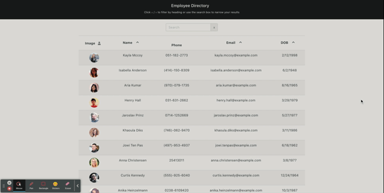

# Employee Directory

## Description 

Employee Directory is an application build with React. The UI is broken up into components, where state is manages and user events are responded to. The user will be able to view their entire employee directory at once so that they have quick access to their information.
An employee or manager would benefit greatly from being able to view non-sensitive data about other employees, and it would be particularly helpful to be able to filter employees by name.

Repository URL: https://github.com/anniemcfarland7/employee-directory

GitHub Pages URL: https://anniemcfarland7.github.io/employee-directory/

## Preview

The following video demonstrates the sample Employee Directory application:

Video URL: https://drive.google.com/file/d/1AeOiYjHHXkYibYg27SqUqPJR26NbyLmk/view
